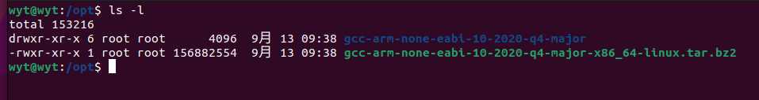
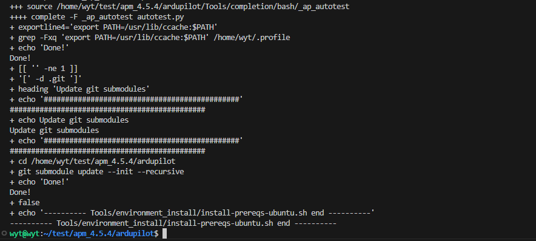
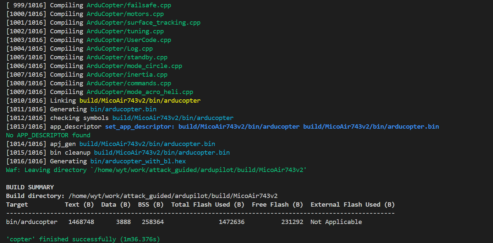
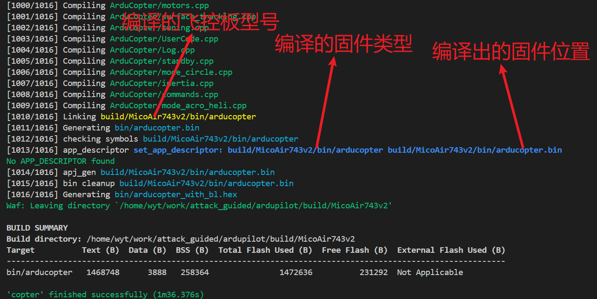

# Ardupilot 编译配置过程

## 1.  从Github克隆Ardupilot仓库到本地

```shell
git clone https://github.com/ArduPilot/ardupilot
```

## 2.  等待克隆完成后，进入 ardupilot文件夹

```shell
cd ardupilot
```

## 3.  开发分支切换

```shell
git checkout Copter-4.x.x
```

## 4.  查看当前开发分支

```shell
git branch
```

## 5.  查看远程仓库分支

```shell
git remote -v
```

## 6.  修改项目子模块的远程仓库路径 

修改仓库子模块地址，打开 **.gitmodules** 文件

```shell
vim .gitmodules
```

将如下内容粘贴进去

```shell
[submodule "modules/waf"]
	path = modules/waf
	url = https://bgithub.xyz/ArduPilot/waf.git
[submodule "modules/gbenchmark"]
	path = modules/gbenchmark
	url = https://bgithub.xyz/google/benchmark.git
[submodule "modules/mavlink"]
	path = modules/mavlink
	url = https://bgithub.xyz/mavlink/mavlink.git
[submodule "gtest"]
	path = modules/gtest
	url = https://bgithub.xyz/ArduPilot/googletest
[submodule "modules/ChibiOS"]
	path = modules/ChibiOS
	url = https://bgithub.xyz/ArduPilot/ChibiOS.git
[submodule "modules/gsoap"]
	path = modules/gsoap
	url = https://bgithub.xyz/ArduPilot/gsoap
[submodule "modules/DroneCAN/DSDL"]
	path = modules/DroneCAN/DSDL
	url = https://bgithub.xyz/DroneCAN/DSDL.git
[submodule "modules/CrashDebug"]
	path = modules/CrashDebug
	url = https://bgithub.xyz/ardupilot/CrashDebug
[submodule "modules/DroneCAN/pydronecan"]
	path = modules/DroneCAN/pydronecan
	url = https://bgithub.xyz/DroneCAN/pydronecan
[submodule "modules/DroneCAN/dronecan_dsdlc"]
	path = modules/DroneCAN/dronecan_dsdlc
	url = https://bgithub.xyz/DroneCAN/dronecan_dsdlc
[submodule "modules/DroneCAN/libcanard"]
	path = modules/DroneCAN/libcanard
	url = https://bgithub.xyz/DroneCAN/libcanard
[submodule "modules/Micro-XRCE-DDS-Client"]
	path = modules/Micro-XRCE-DDS-Client
	url = https://bgithub.xyz/ardupilot/Micro-XRCE-DDS-Client.git
	branch = master
[submodule "modules/Micro-CDR"]
	path = modules/Micro-CDR
	url = https://bgithub.xyz/ardupilot/Micro-CDR.git
	branch = master
[submodule "modules/lwip"]
	path = modules/lwip
	url = https://bgithub.xyz/ArduPilot/lwip.git
[submodule "modules/littlefs"]
	path = modules/littlefs
	url = https://bgithub.xyz/ArduPilot/littlefs.git
[submodule "modules/littlefs"]
	path = modules/littlefs
	url = https://bgithub.xyz/ArduPilot/littlefs.git
```

## 3.  同步仓库内容

参考链接，<https://geek-docs.com/git/git-questions/963_git_git_submodule_update.html>，在此链接可以了解 **git submodule** 的使用方法。

我们需要执行以下命令来初始化子模块并下载代码：

```shell
git submodule sync
git submodule init
git submodule update  或者  git submodule update --init --checkout
```

## 7.  四旋翼固件编译环境安装.

官方提供了脚本，直接运行即可，时间可能比较长，建议在网络好的时候执行。

配置编译环境

```shell
Tools/environment_install/install-prereqs-ubuntu.sh -y
```

下载慢的话也可以选择配置 **pip** 的阿里源

```shell
export PIP_INDEX_URL=https://mirrors.aliyun.com/pypi/simple
source ~/.bashrc
```

在这一步大概率会卡在编译器的安装过程，只能去官网下载安装编译器。没卡的话，就忽略下边这一步。

下面是下载链接  <https://developer.arm.com/downloads/-/gnu-rm/product-release>

下载完成之后，将其放在 **/opt** 目录下， **注：这个路径不推荐改。**

如下图所示：



配置交叉编译器的环境变量

```shell
vim ~/.bashrc
```

```shell
export PATH=/opt/gcc-arm-none-eabi-10-2020-q4-major/bin:$PATH
```

再次执行编译环境安装命令，中途可能会输入root用户的密码

```shell
Tools/environment_install/install-prereqs-ubuntu.sh -y
```

等待安装完成。

安装完成提示如下：



## 8.  进行最后的编译🚀🚀🚀

配置编译工程为自己的飞控板

```shell
bear -- ./waf configure --board MicoAir405v2
bear -- ./waf configure --board MicoAir743v2
bear -- ./waf configure --board xxxxxxxx
```

开始编译四旋翼工程

```shell
bear -- ./waf copter
```

编译完成如下图所示



生成的固件位置在Build目录对应的飞控板文件夹下



至此，Ardupilot的编译环境搭建完成。 
