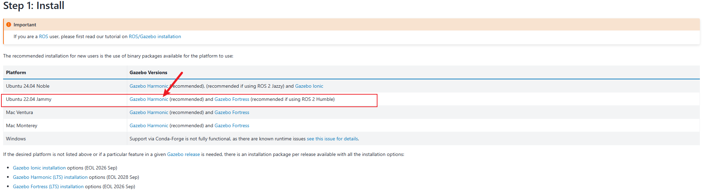
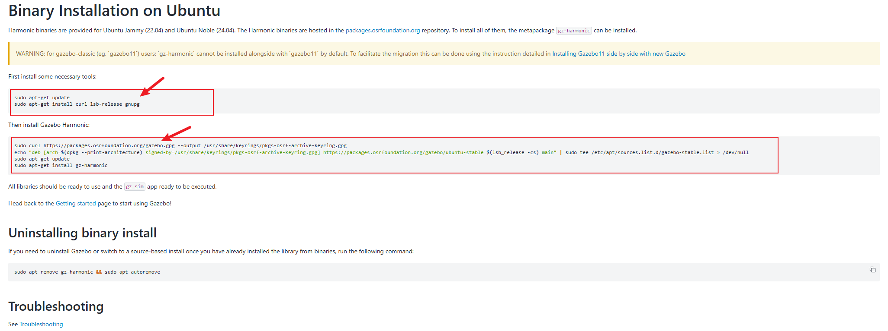
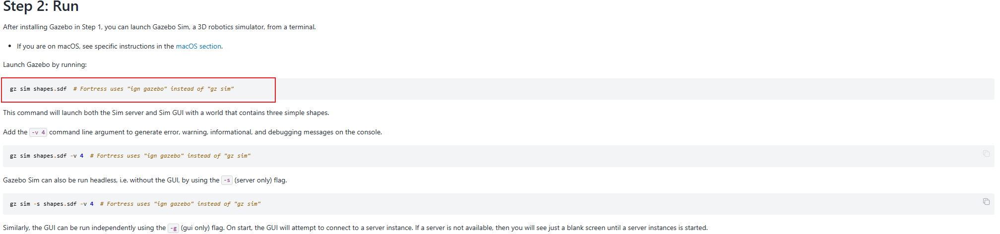
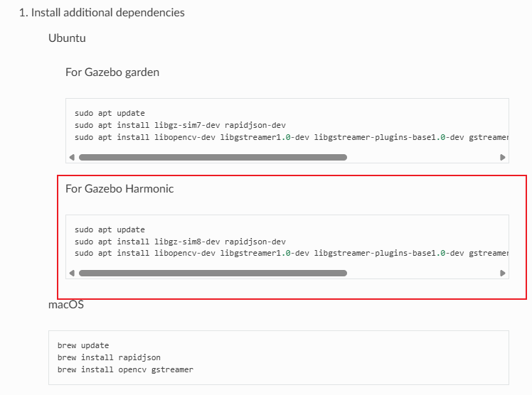

# Gazebo 环境配置过程

## 1.  Gazebo 安装

下载网址：  <https://gazebosim.org/docs/latest/getstarted/>



下载 Ubuntu 22.04 Jammy 对应的gazebo 版本.依照官网教程即可。

根据提示执行命令



对应命令如下：

```shell
sudo apt-get update
sudo apt-get install curl lsb-release gnupg
```

```shell
sudo curl https://packages.osrfoundation.org/gazebo.gpg --output /usr/share/keyrings/pkgs-osrf-archive-keyring.gpg
echo "deb [arch=$(dpkg --print-architecture) signed-by=/usr/share/keyrings/pkgs-osrf-archive-keyring.gpg] https://packages.osrfoundation.org/gazebo/ubuntu-stable $(lsb_release -cs) main" | sudo tee /etc/apt/sources.list.d/gazebo-stable.list > /dev/null
sudo apt-get update
sudo apt-get install gz-harmonic
```

## 2. 安装完成运行测试

参考官网教程



测试一个简单场景

```shell
gz sim shapes.sdf
```

-v 4 命令输出调试信息

```shell
gz sim shapes.sdf -v 4
```

-s 无界面启动，提高仿真速率

```shell
gz sim -s shapes.sdf -v 4
```

## 3.  开始配置 Ardupilot 的 Gazebo 仿真库

首先安装 **gazebo** 和 **ardupilot** 仿真所需的库，参考网站

<https://ardupilot.org/dev/docs/sitl-with-gazebo.html>



执行下载命令

```shell
sudo apt update
sudo apt install libgz-sim8-dev rapidjson-dev
sudo apt install libopencv-dev libgstreamer1.0-dev libgstreamer-plugins-base1.0-dev gstreamer1.0-plugins-bad gstreamer1.0-libav gstreamer1.0-gl
```

克隆仓库的**ardupilot gazebo**代码

注： 一定要在  cd ~ 目录下执行命令。

先执行命令

```shell
cd ~
```

之后创建文件夹进行安装

```shell
mkdir -p gz_ws/src && cd gz_ws/src
git clone https://bgithub.xyz/ArduPilot/ardupilot_gazebo
git clone https://github.com/ArduPilot/ardupilot_gazebo
```

配置build目录安装环境

```shell
export GZ_VERSION=harmonic
cd ardupilot_gazebo
mkdir build && cd build
cmake .. -DCMAKE_BUILD_TYPE=RelWithDebInfo
make -j16
```

配置环境变量，如果时在 **cd ~** 目录下操作的话，按此文章流程直接复制执行即可

在 ~/.bashrc 或其他环境变量文件添加如下内容

```shell
vim ~/.bashrc
```

复制以下命令粘贴即可

```shell
export GZ_SIM_SYSTEM_PLUGIN_PATH=$HOME/gz_ws/src/ardupilot_gazebo/build:$GZ_SIM_SYSTEM_PLUGIN_PATH
export GZ_SIM_RESOURCE_PATH=$HOME/gz_ws/src/ardupilot_gazebo/models:$HOME/gz_ws/src/ardupilot_gazebo/worlds:$GZ_SIM_RESOURCE_PATH
```

或者直接在终端粘贴

```shell
# 或者直接在终端输入
echo 'export GZ_SIM_SYSTEM_PLUGIN_PATH=$HOME/gz_ws/src/ardupilot_gazebo/build:${GZ_SIM_SYSTEM_PLUGIN_PATH}' >> ~/.bashrc
echo 'export GZ_SIM_RESOURCE_PATH=$HOME/gz_ws/src/ardupilot_gazebo/models:$HOME/gz_ws/src/ardupilot_gazebo/worlds:${GZ_SIM_RESOURCE_PATH}' >> ~/.bashrc
```

重启虚拟机，使环境变量生效。

## 4. 开始仿真

注意仿真编译的固件一直是STIL的，真实烧录到飞控的固件就需要自己选择了。

### 4.1 仿真启动命令

Gazebo启动命令，此命令没有目录限制，任意终端目录下运行即可。

```shell
gz sim -v4 -r iris_runway.sdf
gz sim -v4 -r -s iris_runway.sdf
gz sim -v4 -r -s my_10inch_runway.sdf
```

### 4.2 Ardupilot仿真环境启动，只能在目录  ardupilot/Tools/autotest 下执行

```shell
cd dir/ardupilot/Tools/autotest
```

```shell
./sim_vehicle.py -v copter -f gazebo-iris --model JSON --map --console --out=192.168.243.1:14550 -L TEST
./sim_vehicle.py -v copter -f gazebo-iris --model JSON --map --console --out=192.168.243.1:14550 -L Snc_2
./sim_vehicle.py -v copter -f gazebo-iris --model JSON --map --console --out=172.31.47.116:14550 --out=172.31.47.116:14551 -L XiongAn -D
```

### 4.3  Ardupilot GDB仿真启动

-D：debug编译；-G/--gdb：启动GDB；--breakpoint：初始断点

```c++
./sim_vehicle.py -v copter -f gazebo-iris --model JSON --map --console --out=172.31.32.1:14550 -L XiongAn -D -G --breakpoint Copter::update_flight_mode
```

### 4.3 ROS2 启动仿真环境

```shell
colcon build --packages-select node_ardupilot_start
source install/setup.bash
ros2 launch node_ardupilot_start ardupilot_stack.launch.py
```

以上就是仿真环境搭建过程。