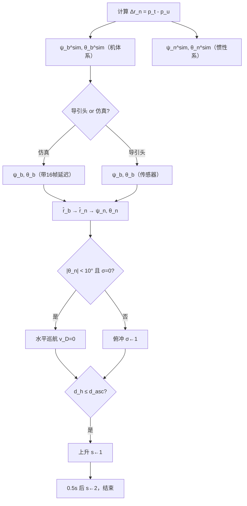

[TOC]

# Guided 模式 SITL 仿真计算数学模型

本文档给出 Guided 模式 VelAccel 子模式下，仿真视线角计算与速度导引的数学描述。符号约定见第 1 节。

---

## 1. 符号与坐标系

### 1.1 坐标系

**NED 惯性系** \(\mathcal{F}_n\)：\(X_n\) 指向北，\(Y_n\) 指向东，\(Z_n\) 指向地（向下为正）。

**机体坐标系** \(\mathcal{F}_b\)：\(X_b\) 沿机头，\(Y_b\) 沿右翼，\(Z_b\) 沿机体向下。

姿态旋转矩阵 \(\mathbf{C}_{bn} \in SO(3)\) 将机体向量变换到 NED：

\[
\mathbf{r}_n = \mathbf{C}_{bn}\,\mathbf{r}_b
\]

其逆变换（NED → 机体）为：

\[
\mathbf{r}_b = \mathbf{C}_{bn}^{\mathsf{T}}\,\mathbf{r}_n
\]

### 1.2 主要符号

| 符号 | 含义 | 单位 |
|------|------|------|
| \(\mathbf{p}_u,\ \mathbf{p}_t\) | 无人机位置、目标位置 | — |
| \(\Delta\mathbf{r}_n = [N,\ E,\ D]^{\mathsf{T}}\) | 目标相对无人机的 NED 位移 | m |
| \(\psi,\ \theta\) | 方位角（azimuth）、高低角（elevation） | rad |
| \(V\) | 标量指令速度 | 1000 cm/s = 10 m/s |
| \(\mathbf{v}_n = [v_N,\ v_E,\ v_D]^{\mathsf{T}}\) | NED 速度指令 | cm/s |
| \(d_h,\ d_v\) | 水平距离、垂直距离 | m |
| \(\phi,\ \lambda,\ h\) | 纬度、经度、相对起飞点高度 | °, °, m |

角度约定：

- **方位角** \(\psi\)：从参考轴（北向或机头）顺时针旋转为正。
- **高低角** \(\theta\)：向下为正（与 \(Z\) 轴正方向一致）。

---

## 2. 目标点

固定目标地理坐标：

\[
\phi_t = 38.8584950°,\quad \lambda_t = 116.0839020°,\quad h_t = h_{\text{GUID\_TGT\_ALT}}
\]

其中 \(h_{\text{GUID\_TGT\_ALT}}\) 为参数，默认值 3.0 m（相对起飞点）。

---

## 3. 相对位移向量

由当前位置 \(\mathbf{p}_u\) 与目标位置 \(\mathbf{p}_t\) 计算 NED 相对向量（三轴距离）：

\[
\Delta\mathbf{r}_n =
\begin{bmatrix} N \\ E \\ D \end{bmatrix}
= \mathbf{p}_t - \mathbf{p}_u \quad (\text{NED 框架})
\]

水平模长：

\[
\rho = \sqrt{N^2 + E^2}
\]

---

## 4. 仿真视线角（SITL 几何解算）

仿真视线角由无人机与目标的几何关系直接计算，不依赖导引头传感器。

### 4.1 机体系仿真视线角

先将 NED 向量变换到机体坐标系：

\[
\mathbf{r}_b = \mathbf{C}_{bn}^{\mathsf{T}}\,\Delta\mathbf{r}_n
= \begin{bmatrix} x_b \\ y_b \\ z_b \end{bmatrix}
\]

机体系方位角与高低角：

\[
\boxed{
\psi_b^{\text{sim}} = \operatorname{atan2}(y_b,\ x_b)
}
\]

\[
\boxed{
\theta_b^{\text{sim}} = \operatorname{atan2}\!\left(z_b,\ \sqrt{x_b^2 + y_b^2}\right)
}
\]

### 4.2 惯性系仿真视线角

直接在 NED 向量上计算，无需姿态变换：

\[
\boxed{
\psi_n^{\text{sim}} = \operatorname{atan2}(E,\ N)
}
\]

\[
\boxed{
\theta_n^{\text{sim}} = \operatorname{atan2}\!\left(D,\ \sqrt{N^2 + E^2}\right)
}
\]

---

## 5. 导引用视线角

用于速度导引的机体系视线角记为 \(\psi_b,\ \theta_b\)，来源分两种模式。

### 5.1 真实导引头模式

\[
\psi_b = \left(\Delta x_{\text{miss}} + \phi_{\text{roll,frame}}\right) \cdot \frac{\pi}{180}
\]

\[
\theta_b = -\left(\Delta y_{\text{miss}} + \phi_{\text{pitch,frame}}\right) \cdot \frac{\pi}{180}
\]

其中 \(\Delta x_{\text{miss}},\ \Delta y_{\text{miss}}\) 为脱靶量，\(\phi_{\text{roll,frame}},\ \phi_{\text{pitch,frame}}\) 为导引头框架角（单位：度）。

### 5.2 仿真模式（带采样延迟）

设控制周期序列为 \(k = 0, 1, 2, \ldots\)，仿真角每 16 帧更新一次（主要用来实现与导引头保持统一频率）：

\[
\left(\psi_b[k],\ \theta_b[k]\right) =
\begin{cases}
\left(\psi_b^{\text{sim}}[k],\ \theta_b^{\text{sim}}[k]\right), & k \bmod 16 = 0 \quad \text{（缓存）} \\[6pt]
\left(\psi_b^{\text{pre}},\ \theta_b^{\text{pre}}\right), & k \bmod 16 \geq 15 \quad \text{（使用缓存值）}
\end{cases}
\]

即在 400 Hz 下约 40 ms 的角更新延迟。

---

## 6. 机体系 → 惯性系视线角转换

将导引用机体系视线角转换为惯性系方位角 \(\psi_n\) 与高低角 \(\theta_n\)，用于速度分配。

**步骤 1**：视线角还原为单位方向向量（机体系）：
\[
\hat{\mathbf{r}}_b =
\begin{bmatrix}
\cos\theta_b \cos\psi_b \\
\cos\theta_b \sin\psi_b \\
\sin\theta_b
\end{bmatrix}
\]

**步骤 2**：旋转至 NED：
\[
\hat{\mathbf{r}}_n = \mathbf{C}_{bn}\,\hat{\mathbf{r}}_b
= \begin{bmatrix} \hat{N} \\ \hat{E} \\ \hat{D} \end{bmatrix}
\]

**步骤 3**：提取惯性系角度：
\[
\boxed{
\psi_n = \operatorname{atan2}(\hat{E},\ \hat{N})
}
\]

\[
\boxed{
\theta_n = \operatorname{atan2}\!\left(\hat{D},\ \sqrt{\hat{N}^2 + \hat{E}^2}\right)
}
\]

---

## 7. 速度导引

标量速度：

\[
V = 1000 \ \text{cm/s} = 10 \ \text{m/s}
\]

设无人机当前 NED 速度 \(\mathbf{v}_n^{\text{cur}} = [v_N^{\text{cur}},\ v_E^{\text{cur}},\ v_D^{\text{cur}}]^{\mathsf{T}}\)（m/s）。

俯冲触发标志 \(\sigma \in \{0, 1\}\)，初始 \(\sigma = 0\)。

### 7.1 水平巡航阶段

**条件**：

\[
|\theta_n| < 10° \quad \text{且} \quad \sigma = 0
\]

**速度指令**（NED，cm/s）：
\[
\boxed{
v_N = V\cos\psi_n,\quad
v_E = V\sin\psi_n,\quad
v_D = 0
}
\]

无人机仅沿水平面内视线方向飞行，无垂直分量。

### 7.2 俯冲阶段

**条件**：
\[
|\theta_n| \geq 10° \quad \text{或} \quad \sigma = 1
\]

触发后置 \(\sigma \leftarrow 1\)（不可逆）。

**速度指令**（NED，cm/s）：
\[
\boxed{
v_N = V\cos\theta_n \cos\psi_n
}
\]

\[
\boxed{
v_E = V\cos\theta_n \sin\psi_n
}
\]

\[
\boxed{
v_D = -\sqrt{\left(v_N^{\text{cur}}\right)^2 + \left(v_E^{\text{cur}}\right)^2}\;\sin\theta_n \times 100
}
\]

注：\(v_N^{\text{cur}},\ v_E^{\text{cur}}\) 取当前 NED 北向与东向速度（m/s），乘以 100 换算为 cm/s 量级后与 \(\sin\theta_n\) 相乘。

**算例**：\(V = 1000\)，\(\theta_n = 10°\)，\(\psi_n = 5°\) 时：

\[
v_N = 1000 \cos 10° \cos 5° \approx 981.06 \ \text{cm/s}
\]

\[
v_E = 1000 \cos 10° \sin 5° \approx 85.83 \ \text{cm/s}
\]

---

## 8. 距离量

**水平距离**（大圆弧距离）：

\[
d_h = \|\mathbf{p}_{u,xy} - \mathbf{p}_{t,xy}\|
\]

**垂直距离**（高度差绝对值）：
\[
d_v = |h_u - h_t|
\]

---

## 9. 状态切换条件

### 9.1 任务区域约束

\[
38.8569789° \leq \phi_u \leq 38.8635621°
\]

\[
116.0830184° \leq \lambda_u \leq 116.0851157°
\]

\[
h_u \leq 50 \ \text{m}
\]

违反任一条件则终止导引。

### 9.2 任务超时

进入 VelAccel 后累计时间 \(T > 200\) s 则终止导引。

### 9.3 上升阶段触发

设上升状态 \(s \in \{0, 1, 2\}\)，初始 \(s = 0\)。

**触发条件**（\(s = 0\) 时）：
\[
d_h \leq d_{\text{asc}} \quad \left(d_{\text{asc}} = \text{GUID\_ASC\_DIST},\ \text{默认}\ 5\ \text{m}\right)
\]

触发后 \(s \leftarrow 1\)，记录起始时刻 \(t_0\)。

### 9.4 上升阶段控制

当 \(s = 1\) 时：

\[
v_N = 0,\quad v_E = 0,\quad a_D = -4000 \ \text{cm/s}^2
\]

（NED 中 \(a_D < 0\) 表示向上加速度，等价于 40 m/s² 拉升。）

持续 \(\Delta t = 0.5\) s 后，\(s \leftarrow 2\)，任务结束。

### 9.5 低高度辅助触发

当 \(\sigma = 1\) 且 \(h_u < h_{\text{asc}}\)（\(h_{\text{asc}} = \text{GUID\_ASC\_ALT}\)，默认 5 m）时，重置上升计时 \(t_0\)。

---

## 10. 完整计算流程

---

## 11. 公式汇总

| 步骤 | 公式 |
|------|------|
| NED 相对向量 | \(\Delta\mathbf{r}_n = [N,\ E,\ D]^{\mathsf{T}}\) |
| 机体系仿真角 | \(\psi_b^{\text{sim}} = \operatorname{atan2}(y_b, x_b),\ \theta_b^{\text{sim}} = \operatorname{atan2}(z_b, \rho_b)\) |
| 惯性系仿真角 | \(\psi_n^{\text{sim}} = \operatorname{atan2}(E, N),\ \theta_n^{\text{sim}} = \operatorname{atan2}(D, \rho)\) |
| 单位视线向量 | \(\hat{\mathbf{r}}_b = [\cos\theta_b\cos\psi_b,\ \cos\theta_b\sin\psi_b,\ \sin\theta_b]^{\mathsf{T}}\) |
| 惯性系导引角 | \(\psi_n = \operatorname{atan2}(\hat{E}, \hat{N}),\ \theta_n = \operatorname{atan2}(\hat{D}, \sqrt{\hat{N}^2+\hat{E}^2})\) |
| 水平巡航 | \(v_N = V\cos\psi_n,\ v_E = V\sin\psi_n,\ v_D = 0\) |
| 俯冲 | \(v_N = V\cos\theta_n\cos\psi_n,\ v_E = V\cos\theta_n\sin\psi_n,\ v_D = -\|\mathbf{v}_{xy}^{\text{cur}}\|\sin\theta_n \times 100\) |

其中 \(\rho = \sqrt{N^2+E^2}\)，\(\rho_b = \sqrt{x_b^2+y_b^2}\)，\(V = 1000\) cm/s。

